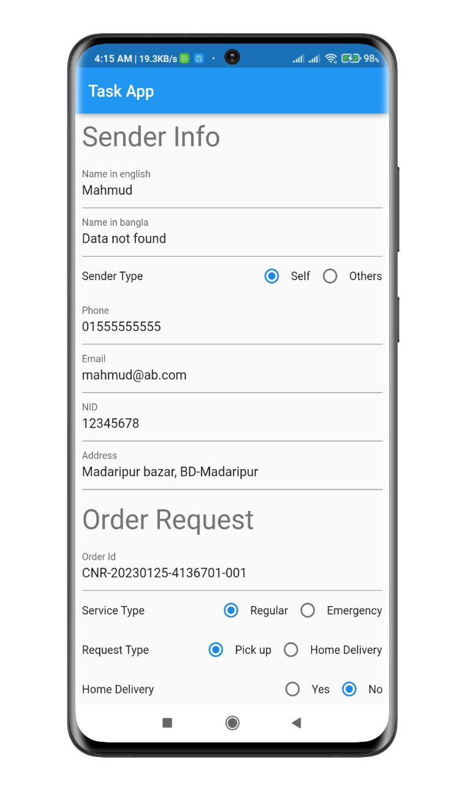

# Task App

This is an assignment app from DOER Services Ltd. The task is: Listen the response from json and set that to textfield, radio and list what is applicable.
## Screenshots

<p align="center">
  
  
</p>


## Features

- Data showing from json file


## Setup

Clone the repository

```bash
  git clone https://github.com/muradhossin/task_app.git
```
Move to the desired folder

```bash
  cd \task_app
```
To run the app, simply write

```bash
  flutter pub get
```
```bash
  flutter run
```
## Tech Stack

**Built With:** Dart, Flutter

**State Management:** Provider

**JSON:** Local JSON File


## Platform

- Android


## Contributing

Contributions are always welcome!

See `contributing.md` for ways to get started.

Please adhere to this project's `code of conduct`.


## License

[MIT](https://choosealicense.com/licenses/mit/)


## Support

For support, please contact here [](https://linkedin.com/in/md-murad-hossin)

  💰 You can help me by Donating
  [](https://buymeacoffee.com/muradhossin) 
